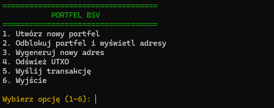

# BSV HD Wallet

A lightweight Hierarchical Deterministic (HD) wallet implementation for **Bitcoin SV (BSV)** written in Python.

<p align="center">
  
</p>

---

## Features

- Hierarchical Deterministic (HD) wallet
- BIP39 mnemonic support
- BIP32 key derivation
- Bitcoin SV (BSV) address generation
- SQLite wallet database
- Testnet and Mainnet support
- UTXO retrieval via WhatsOnChain API
- Transaction creation and broadcasting
- Simple console interface

---

## Project Structure

```
.
├── config.py    # Configuration (network selection, API settings)
├── crypto.py    # Mnemonic and cryptographic functions
├── db.py        # SQLite database layer
├── hdp.py       # HD wallet and address derivation
├── main.py      # Main application logic
├── ui.py        # Console user interface
└── woc.py       # WhatsOnChain API integration
```

---

## Configuration

The wallet can be configured through `config.py`.

Available options include:

- Network selection (`mainnet` / `testnet`)
- WhatsOnChain API endpoint
- Database configuration

---

## Requirements

- Python 3.11+
- bsv-sdk
- SQLite (included with Python)

---

## Installation

Clone the repository:

```bash
git clone https://github.com/xpanalyst/bsv-hd-wallet.git
cd bsv-hd-wallet
```

Run the application:

```bash
python main.py
```

---

## Disclaimer

This software is provided for educational and experimental purposes.

Always verify transactions before broadcasting them to the Bitcoin SV network.

Do not use this software to store significant amounts of cryptocurrency without thoroughly reviewing and testing the source code.

---

## License

This project is licensed under the MIT License.
